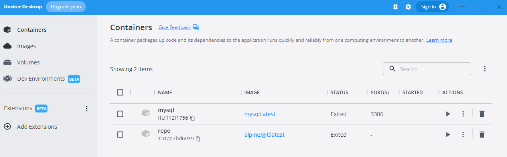
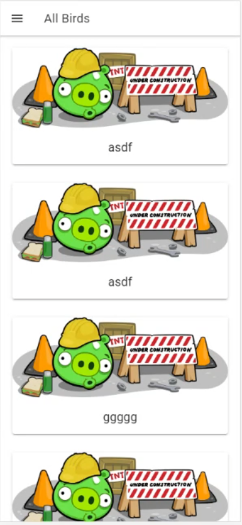

# Angry Birds

- En la práctica 1 vamos a aprender lo siguiente:
     - Puntos oligatorios que necesita el proferor:
        - Como construir el backend con node y sequalize.(ver pdfs aportados por el profesor).
        - Como construir el frontend con ionic - react (en mi caso, el profesor realiza el proyecto con Ángular).
    - Otros conocimientos adquiridos mediante investigación:
        - Como habilitar un servicio docker con mysql para conectar el backend construido en el punto anterior.

La app mostrará una lista de pájaros y si se pulsa en cada uno de ellos, podrá visualizar las características del pájaro.
Si pulsa en el menú superior de la izquierda, podrá acceder a la pantalla para realizar "cambios" en alguno de los pájaros, es decir, podrá añadir, actualizar y borrar un pájaro de la lista.

## Comenzando 🚀

El repositorio se divide en 4 carpetas:

- frontend --> donde estara la app hecha con ionic y react
- backend --> aqui montaremos nuestra api-Rest con node.
- postman --> archivos para que la importación de los endpoints y realizar pruebas de manera local.
- assets -> carpeta ubicada fuera de las ya mencionadas para guardar las imágenes mostradas en el readme.


### Pre-requisitos 📋

Para este proyecto, necesitamos instalar lo siguiente:

```
nodejs
ionic
docker desktop
```

### Instalación 🔧

Node

```
Descargar de la página https://nodejs.org/en/
```

Ionic

```
npm install -g "ionic/cli
```

Docker (no es obligatorio instalar esta aplicación para que funcione la app. Basta con enlazarlo a la base de datos que se haya configurado)

```
https://www.docker.com/products/docker-desktop/

Entrar en docker hub, buscar la imagen mysql, descargarla y seguir el tutorial que indica en la propia página. https://hub.docker.com/_/mysql
```
<div>
<p style = 'text-align:center;'>

</p>
</div>

<div>
<p style = 'text-align:center;'>

</p>
</div>


## Construido con 🛠️

* [Ionic](https://ionicframework.com/) - Framework usado.
* [React](https://es.reactjs.org/) - Librería javascript para construir interfaces de usuario.

## Enlace a POSTMAN con los endpoints utilizados.

- https://www.postman.com/supply-geologist-74417416/workspace/44e7c651-33bf-4522-8418-28e64feadd40/collection/21375750-19e668b7-19b5-4b16-8b68-e2154d1eeaff?action=share&creator=21375750

## Autores ✒️

* **Idaira Alemán Quintana**


## Licencia 📄

Licencia para no morir en el intento.

## Expresiones de Gratitud 🎁

* Invita una cerveza 🍺 o un café ☕. Mejor lo primero. 
* Da las gracias públicamente 🤓.
* Dar también las gracias a los de endesa por dejarme hacer el proyecto tranquila.


---

⌨️ con ❤️ por [Idaira Alemá Quintana) 😊
